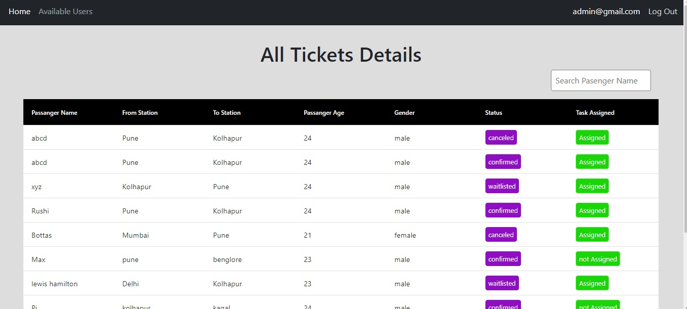

# Assessment

## Ticket Management System 
# workflow -

### Accounts -
- Three types of Accounts
    
    1. Admin -

    - Admin Have Authority to assign task to tech supporter.

    - Admin can delete user's Accounts

    2. Tech Supporter -

    - Tech Supporter can change the status of users Ticket (example - to confirm ticket)

    3. User -

    - User can create Tickets 
    - User can see the list of created tickets and see the status of that ticket

## Technologies Used -

    1. React Js
    2. Bootstrap
    3. Sass
    4. Json Data (Json Server)

## Extra packages (dependencies) installed -

- redux
- axios
- react-data-table
- fontAwesome
- sweetalert 2
- react router
- Bootstrap

# Explaination for Database - 

- The Backend Database is a JSON File db.Js
- which is handled by json Server
- currently in this project the server is running on 3000 port
Endpoints:
http://localhost:3000/

- so all the api's handled with this api Endpoints
- in it recommended that run this json server on 3000 port

the structure of json file is -

{

     "users": [
    {
      "name": "supporter",
      "email": "supporter@gmail.com",
      "password": 22222222,
      "role": "supporter",
      "id": "0d76"
    },
    {
      "name": "admin",
      "email": "admin@gmail.com",
      "password": 11111111,
      "role": "admin",
      "id": "5c13"
    },
    {
      "id": "11d5",
      "name": "user",
      "email": "abcd@gmail.com",
      "password": "12341234",
      "role": "user"
    }
  ],

   "tickets": [

    {
      "id": "71ce",
      "user": "abcd@gmail.com",
      "passengerName": "abcd",
      "fromStation": "Pune",
      "toStation": "Kolhapur",
      "passengerAge": "24",
      "gender": "male",
      "status": "canceled",
      "taskAssigned": "Assigned"
    }
   ]
}

### above user array is the data of users , tech supporters  and admin
### both admin and tech supporter credential are important to access that functionality
### Tickets array is the data of tickets created by user and chenged status by admin/tech supporter

## Screenshots

### sign up 
;
;
;

- above image is a sign up page with also toggle password visibility 
## above sign up also have all validation of email password and if the user is already existed then it shows the error popup

- it is used to create account
- we already have a admin and tech supporter credential in our json file.
- on click on sign in page will redirected to sign in page
- ### NOTE - The sign in with github and gmail is only for making UI attractive those functionality never work.

### sign in 
;
;

- above is the sign in page which also have validation like email password if user inputed wrong credential the alert pop up will get shown.
- user,Tech Supporter and admin can login through this age 

### user home page 
;
;

- above screenshots are the pages of user home page where user can create a ticket by filling above information 
- the input fields have a validation

### user tickets details page 
;

- In the page of Your Tickets the user can see his created tickets with the status of that ticket 

### admin home page 
;

- above image shows the home page of admin which contents all the information of tickets its status and task is assigned to Tech supporter or not

;

- in above image we can filter the records by using the passenger name

;

- Admin have an authority to change the status of ticket
- on onclick of status column button admin able to chenge the status of ticket thourgh the modal box

;

- user have an authority to assign the task to Tech Supporter 
- if the task is not assigned then admin can assign the task to the tech supporter
- In above image it is a confirmation from admin to assign the task to the tech supporter
 
;

- after assigning task the success pop is shown in screen

;

- This is Available User page 
- where admin can see all users account and have authority to delete that account

;

# for this time i disabled the delete option for Tech Supporter role and Admin role 

;

- before delete user account there is a confirm massage shown to the admin

;

- after confirmation that user account will get deleted

;

- this is Tech supporter home page where supporter can see those task assigned by the admin

;

- Tech Supporter have authority to change the status of ticket 
- In above image as shown the tech supporter can change the status of ticket through modal

## HTTP Methods used
  - get
  - post
  - put 
  - delete

### Redux toolkit use 

- Redux global state management library is used for state management 
- the all user details from json file users array is fetched and stored in redux state when the url is get change
- all the tickets details is stored in redux state
- the redux state is updated of the data comes from api 

